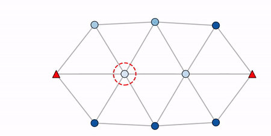
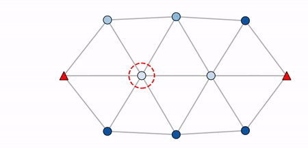

# hmr_sim

[](https://www.python.org/downloads/)
[](https://github.com/Farama-Foundation/Gymnasium)


This package provides a hmr_sim simulator built with Gymnasium for testing and developing multi-agent system algorithms. It is designed for quickly creating new mission scenarios.


## Installation

1. **Dependencies**: 

    Install dependencies via the requirements file.

    ```bash
    cd hmr_sim
    pip install -r requirements.txt
    ```

2. **Set up the package:**

    ```bash
    pip install -e . 
    ```


## Available Environments

For simplicity, a single Gymnasium environment is created to handle all multiple mission scenarios and parameters using a config file.
This environment is named ```Hetero-V0``` and inherits from the  ```Base``` environment. The ```Base``` environment handles all the map related behaviours and is created separately from ```Hetero-V0``` to allow extensions to multiple environments if needed in the future.

## Usage Examples

The table below illustrates examples of creating different mission scenarios. The provided YAML files can be used as samples to experiment with various mission setups and parameters.

| Mission Scenario                                                                                                                                                                                                | Command                                                                                              | Visualization                                                                                                                                                            |
|-----------------------------------------------------------------------------------------------------------------------------------------------------------------------------------------------------------------|------------------------------------------------------------------------------------------------------|--------------------------------------------------------------------------------------------------------------------------------------------------------------------------|
| Connectivity control with addition of new agents when the connectivity is low.                                                                                                                                  | ```python3 test_hetro.py add_agent_base.yaml``` <br> ```python3 test_hetro.py add_agent_near.yaml``` |  <br>  |
| An example of a heterogeneous system with a stationary base station (red), 4 mobile robots (yellow) that follow an RRT-defined path to goals, and UAVs (blue) that maintain connectivity of the entire network. | ```python3 test_hetro.py hetro.yaml```                                                               |                                                                                                  |
| An example where the UAVs (blue) perform obstacle avoidance.                                                                                                                                                    | ```python3 test_hetro.py obstacle.yaml```                                                            |                                                                                               |
| A mission with 2 robots (yellow) exploring an unknown environment using frontier exploration, while UAVs (blue) maintain connectivity between these robots and the base station (red).                          | ```python3 test_hetro.py explore_x.yaml```                                                           |                                                                                |


## Directory Structure

This package is organized as follows:

## TODOs

- [ ] **Bug**: For different path types (circle, ellipse, square), agents move at varying speeds even when the speed variable is the same. Redo perimeter sampling logic.
- [ ] **Error Handling**: Raise an error if a formation is initialized within an obstacle.
- [ ] **Validation**: Create a function to validate configuration combinations.   For example: If there are two agents and the `go_to_goal` controller is chosen, ensure that two goal positions are specified.


[//]: # (- [ ] Error: Possibly when agents enter the obstacle.)

[//]: # (yellow)

[//]: # (    adjusted_position = self.obstacle_avoidance&#40;proposed_position=proposed_position, )

[//]: # (  File "/home/anton-superior/hmr_sim/hmr_sim/utils/agent.py", line 217, in obstacle_avoidance)

[//]: # (    if is_free_path_fn&#40;current_position, check_point&#41;:)

[//]: # (  File "/home/anton-superior/hmr_sim/hmr_sim/envs/hetro/base.py", line 74, in is_line_of_sight_free)

[//]: # (    end = position_to_grid&#40;position2&#41;)

[//]: # (  File "/home/anton-superior/hmr_sim/hmr_sim/envs/hetro/base.py", line 69, in position_to_grid)

[//]: # (    grid_x = int&#40;&#40;position[0] - self.origin['x']&#41; / self.resolution&#41;)

[//]: # (ValueError: cannot convert float NaN to integer)

[//]: # ()
[//]: # (- [ ] RRT KNOWS THE WHOLE MAP!)

[//]: # ()
[//]: # (- [ ] Sometimes something goes horibly wrong when network breaks)

[//]: # ()
[//]: # (nton-superior@antonsuperior:~/hmr_sim/hmr_sim/tests$ python3 hetro/test_hetro.py thesis1.yaml)

[//]: # (Loading configuration from: /home/anton-superior/hmr_sim/hmr_sim/tests/hetro/thesis1.yaml)

[//]: # (Initializing environment: Hetro-v0)

[//]: # (Using initialization formation: {'shape': 'lattice', 'origin': [0.0, 0.0], 'major_radius': 3.0})

[//]: # (Number of agents is 12, which is <= 12)

[//]: # (base: [-3.5  0. ])

[//]: # (Adding new agent at position: [-3.11058837  1.70612385])

[//]: # (Type: 2, ID: 2, batetery type: 1.0)

[//]: # (Agent 2 removed due to low battery.)

[//]: # (Number of agents is 12, which is <= 12)

[//]: # (base: [-3.5  0. ])

[//]: # (Adding new agent at position: [-4.59110715  1.36820509])

[//]: # (Type: 2, ID: 3, batetery type: 1.0)

[//]: # (Agent 3 removed due to low battery.)

[//]: # (Number of agents is 12, which is <= 12)

[//]: # (base: [-3.5  0. ])

[//]: # (Adding new agent at position: [-3.88941163 -1.70612385])

[//]: # (Type: 2, ID: 4, batetery type: 1.0)

[//]: # (Agent 4 removed due to low battery.)

[//]: # (Number of agents is 12, which is <= 12)

[//]: # (base: [-3.5  0. ])

[//]: # (Adding new agent at position: [-5.07669552  0.75929654])

[//]: # (Type: 2, ID: 5, batetery type: 1.0)

[//]: # (Agent 5 removed due to low battery.)

[//]: # (Number of agents is 12, which is <= 12)

[//]: # (base: [-3.5  0. ])

[//]: # (Adding new agent at position: None)

[//]: # (Type: 2, ID: 6, batetery type: 1.0)

[//]: # (Traceback &#40;most recent call last&#41;:)

[//]: # (  File "/home/anton-superior/hmr_sim/hmr_sim/tests/hetro/test_hetro.py", line 73, in <module>)

[//]: # (    main&#40;&#41;)

[//]: # (  File "/home/anton-superior/hmr_sim/hmr_sim/tests/hetro/test_hetro.py", line 70, in main)

[//]: # (    run&#40;config&#41;)

[//]: # (  File "/home/anton-superior/hmr_sim/hmr_sim/tests/hetro/test_hetro.py", line 40, in run)

[//]: # (    env.render&#40;&#41;)

[//]: # (  File "/home/anton-superior/.local/lib/python3.10/site-packages/gymnasium/core.py", line 332, in render)

[//]: # (    return self.env.render&#40;&#41;)

[//]: # (  File "/home/anton-superior/.local/lib/python3.10/site-packages/gymnasium/wrappers/common.py", line 409, in render)

[//]: # (    return super&#40;&#41;.render&#40;&#41;)

[//]: # (  File "/home/anton-superior/.local/lib/python3.10/site-packages/gymnasium/core.py", line 332, in render)

[//]: # (    return self.env.render&#40;&#41;)

[//]: # (  File "/home/anton-superior/.local/lib/python3.10/site-packages/gymnasium/wrappers/common.py", line 303, in render)

[//]: # (    return self.env.render&#40;&#41;)

[//]: # (  File "/home/anton-superior/hmr_sim/hmr_sim/envs/hetro/hetro_v0.py", line 56, in render)

[//]: # (    self.render_func.render&#40;&#41;)

[//]: # (  File "/home/anton-superior/hmr_sim/hmr_sim/utils/vis.py", line 184, in render)

[//]: # (    self.update_adjacency_lines&#40;&#41;)

[//]: # (  File "/home/anton-superior/hmr_sim/hmr_sim/utils/vis.py", line 91, in update_adjacency_lines)

[//]: # (    adjacency_matrix = self.swarm.compute_adjacency_matrix&#40;&#41;)

[//]: # (  File "/home/anton-superior/hmr_sim/hmr_sim/utils/swarm.py", line 139, in compute_adjacency_matrix)

[//]: # (    distance = euclidean&#40;positions[i], positions[j]&#41;)

[//]: # (  File "/home/anton-superior/.local/lib/python3.10/site-packages/scipy/spatial/distance.py", line 520, in euclidean)

[//]: # (    return minkowski&#40;u, v, p=2, w=w&#41;)

[//]: # (  File "/home/anton-superior/.local/lib/python3.10/site-packages/scipy/spatial/distance.py", line 480, in minkowski)

[//]: # (    dist = norm&#40;u_v, ord=p&#41;)

[//]: # (  File "/home/anton-superior/.local/lib/python3.10/site-packages/scipy/linalg/_misc.py", line 146, in norm)

[//]: # (    a = np.asarray_chkfinite&#40;a&#41;)

[//]: # (  File "/home/anton-superior/.local/lib/python3.10/site-packages/numpy/lib/function_base.py", line 628, in asarray_chkfinite)

[//]: # (    raise ValueError&#40;)

[//]: # (ValueError: array must not contain infs or NaNs)